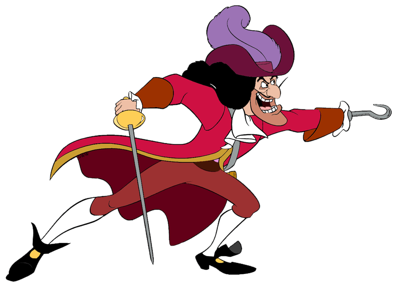

# captain-hook

Generic message dispatcher for webhooks using the Actor framework in Service Fabric

## Using EDA

1. Create Domain Models which are inherited from DomainEvent
2. Setup Messager client and inject into BigBrother Instance (Use Method)
3. Sent Domain Events to BigBrother on the publish method

### EDA Pre Setup

1. Register Config with Captain Hook
  1. Domain Event Name (full namespace)
  2. Hook URI
  1. Any Auth required for this endpoint
  2. Callback with response
  1. Auth required for the callback endpoint.
  

Per authorisation for internal services, OAuth2 scopes are used to control access to the webhook endpoints. Captain Hook much be allowed to consume this scope. For example, assume a scope of "servicea.webhook.api.all" which has been created by the development team. The scope has been assinged to their controller for authroisation of the endpoints. And the scope has been assigned to Captain Hook in the STS. Further Captain Hook must request this scope when aquiring it's bearer token. The token is then used in all subsequent calls to each internal service.
